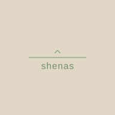

<p align="center">
  
</p>

<h1 align="center">shenas</h1>

<p align="center">
  <a href="https://github.com/shenas-net/shenas/actions/workflows/ci.yml"></a>
  
  
</p>

A local-first quantified-self platform. shenas collects health, finance, and lifestyle data from the services you already use, normalizes it into canonical schemas, trains models on-device via federated learning, and visualizes it through pluggable web components. Your raw data stays on your machine.

## Community

- [Discourse forum](https://shenas.discourse.group/) -- questions, feature requests, show-and-tell
- [Discord server](https://discord.gg/VKsUVT9q) -- real-time chat and support

## Getting started

```bash
uv sync                              # install all workspace packages
make hooks-setup                     # install pre-commit hook (ruff + ty)
```

Then install globally:

```bash
make app-install                     # puts shenasctl + shenas on your PATH
```

## Stack

| Layer | Tools |
|-------|-------|
| Package management | uv (workspace), moon (task runner), hatchling (wheel builds) |
| Data ingestion | dlt (`@dlt.source`, `@dlt.resource`, incremental cursors) |
| Storage | DuckDB (local, per-user) |
| Server | FastAPI, Strawberry GraphQL, Arrow IPC |
| Frontend | Lit, uPlot, Cytoscape, Vite |
| Desktop / mobile | Tauri v2 (desktop: PyInstaller sidecars, mobile: Rust + axum) |
| ML | Flower (federated learning), PyTorch |
| Observability | OpenTelemetry (spans + logs to DuckDB, real-time SSE) |
| Distribution | Ed25519-signed Python wheels via GitHub Releases |

## Architecture

### Data flow

```
Source API --> dlt --> raw DuckDB tables --> SQL transforms --> metrics.* --> Arrow IPC --> web components
               |          (garmin.*)         (idempotent)       (canonical)
               |          (strava.*)
               v
          source-specific schemas
```

### Workspace packages

The repo is a uv workspace. Each directory is a separate Python package with its own `pyproject.toml`:

| Package | Path | Role |
|---------|------|------|
| `shenas-cli` | `shenasctl/` | Lightweight CLI client (httpx, typer, cryptography). No server deps. |
| `shenas-app` | `app/` | FastAPI UI server, GraphQL API, Arrow IPC queries |
| `shenas-scheduler` | `scheduler/` | Background sync daemon sidecar |
| `shenas-plugin-core` | `plugins/core/` | Shared plugin utilities, Table ABC |
| `shenas-source-core` | `plugins/sources/core/` | Source table utilities, kind base classes |
| `shenas-dataset-core` | `plugins/datasets/core/` | MetricTable, Dataset ABC, DDL generation |

### Plugin system

Everything in `plugins/` is a plugin. Each plugin kind registers via a Python entry point group and is discovered at runtime with `importlib.metadata.entry_points()`.

| Kind | Entry point group | Examples |
|------|-------------------|---------|
| Source | `shenas.sources` | garmin, spotify, strava, lunchmoney, gmail, ... |
| Dataset | `shenas.datasets` | fitness, finance, events, outcomes, habits, location |
| Dashboard | `shenas.dashboards` | fitness, data-table, event-gantt, timeline |
| Frontend | `shenas.frontends` | default, focus |
| Theme | `shenas.themes` | default, dark |
| Transformation | `shenas.transformations` | sql, dedup-merge, geocode, llm-categorize, ... |
| Analysis | `shenas.analyses` | hypothesis |
| Model | `shenas.models` | sleep-forecast |

Each plugin has its own `pyproject.toml`, `VERSION` file, and `moon.yml`. Plugins are distributed as Ed25519-signed wheels. Users install them with `shenasctl source add <name>`.

### Table kinds

Every raw source table inherits from a kind base class in `shenas_sources.core.table`. The kind determines the dlt write_disposition automatically:

| Kind | Semantics | dlt strategy |
|------|-----------|-------------|
| `EventTable` | Immutable occurrence at a point in time | merge on id |
| `IntervalTable` | Occurrence with start + end timestamps | merge on id |
| `SnapshotTable` | Current self-state, no temporal axis | SCD2 |
| `DimensionTable` | Reference/lookup data other tables join against | SCD2 |
| `AggregateTable` | Per-window summary, re-emitted as data arrives | merge on window key |
| `CounterTable` | Monotonically growing scalar, deltas matter | append |
| `M2MTable` | Many-to-many bridge between two entities | SCD2 |

### Directory layout

```
app/                   FastAPI server, GraphQL, Arrow IPC, telemetry, mesh, FL
shenasctl/             CLI client
scheduler/             Background sync daemon
server/
  api/                 shenas.net web API (LLM proxy, literature gateway)
  fl/                  Federated learning coordinator
  deploy/              Kubernetes, OpenTofu, Docker configs
plugins/
  core/                Shared plugin utilities
  sources/             Source connectors (garmin, spotify, strava, ...)
  datasets/            Canonical metric schemas (fitness, finance, ...)
  dashboards/          Lit web components (fitness, data-table, ...)
  frontends/           UI shells (default, focus)
  themes/              CSS custom properties (default, dark)
  analyses/            Analysis modes (hypothesis)
  transformations/     Transform plugins (sql, geocode, llm-categorize, ...)
  models/              ML models (sleep-forecast)
scripts/               Build helpers (version bumping, pre-commit)
prompts/               Guiding documents for LLMs (tone of voice, design system)
```

## Development

### Common commands

```bash
# Run
shenasctl --help                     # CLI
shenasctl source garmin sync         # sync a source

# Lint, test, build (same commands as CI)
moon run :lint                       # all lints: Python + JS lint, format, typecheck
moon run :test                       # all tests
make coverage                        # tests with coverage report
moon run app:python-test             # single project
moon run :build                      # build all wheels
moon run source-garmin:build         # build one package
moon run desktop:tauri               # build desktop app
```

### Pre-commit hooks

The pre-commit hook runs `ruff check`, `ruff format --check`, and `ty check` before every commit. Install with `make hooks-setup`.
